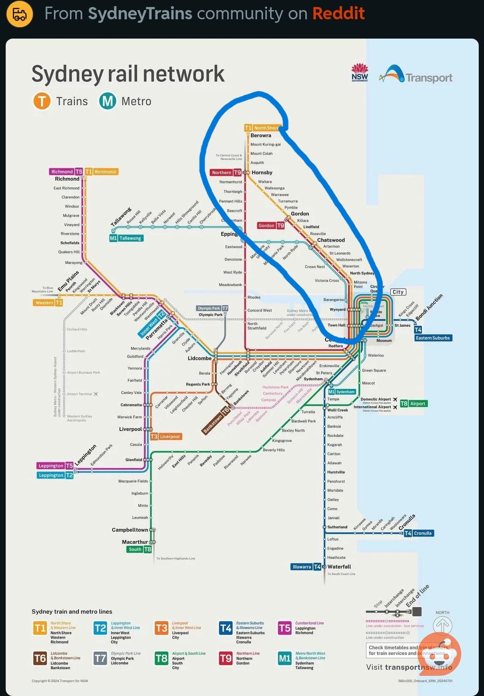
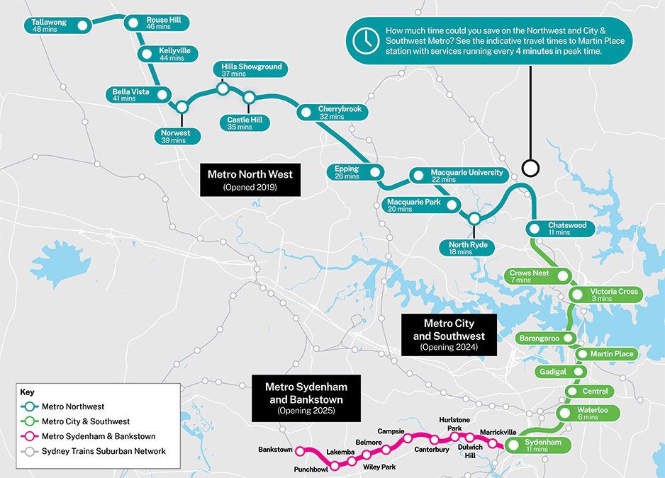

## Train Schedules

The Tripview app is the best option for this. It is live updated with train delays/railwork and has detailed tracking for anything you may need.

Apple: <https://apps.apple.com/au/app/tripview/id294730339>

Google: <https://play.google.com/store/apps/details?id=com.grofsoft.tripview&hl=en_AU>

## T1 Network

Aim for no further out than Killara on the T1 line!

## Sydney Metro Network

Any further than Epping on the North-West line or Waterloo on the Southwest line will be a long journey!

Note: The Metro Sydenham and Bankstown line (pink) is not yet open.
